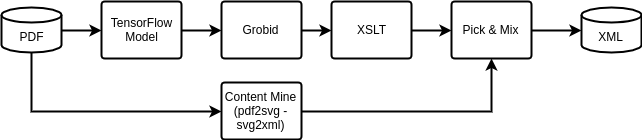

# ScienceBeam

[](https://travis-ci.org/elifesciences/sciencebeam)
[](LICENSE)

A set of tools to allow PDF to XML conversion, utilising [Apache Beam](https://beam.apache.org/) and other tools.

The aim of this project is to bring multiple tools together to generate a full XML document.

You might also be interested in the [ScienceBeam Gym](https://github.com/elifesciences/sciencebeam-gym), for the model training ground (the model is not yet integrated into the conversion pipeline).

## Status

This is in a very early status and may change significantly.

## Docker

Note: If you just want to use the API, you could make use of the [docker image](doc/Docker.md).

## Pre-requisites

- Python 3 (Apache Beam may still log a warning until it is fully supported)
- [Apache Beam](https://beam.apache.org/get-started/quickstart-py/)
- [Libre Office Write (lowrite)](https://www.libreoffice.org/discover/writer/) for converting Doc(x) files

## Pipeline

The conversion pipeline could for example look as follows:



See below for current example implementations.

## Simple Pipeline

A simple non-Apache Beam specific pipeline definition exists and can be configured using _app.cfg_ (defaults in: [app-defaults.cfg](app-defaults.cfg)).

The pipeline can be executed directly (e.g. as part of the API, see below) or translated and run as an Apache Beam pipeline.

To run the pipeline using Apache Beam:

```bash
python -m sciencebeam.pipeline_runners.beam_pipeline_runner \
  --data-path=/home/deuser/_git_/elife/pdf-xml/data/other/00666 --source-path=*.pdf \
  --grobid-url=http://localhost:8070/api
```

To get a list of all of the available parameters:

```bash
python -m sciencebeam.pipeline_runners.beam_pipeline_runner --help
```

Note: the list of parameters may change depending on the configured pipeline.

Current pipelines:

- [GROBID /w XSLT pipeline](sciencebeam/pipelines/grobid_pipeline.py)
- [Doc to PDF pipeline](sciencebeam/pipelines/doc_to_pdf_pipeline.py)

## API Server

The [API](doc/API.md) server is currently available in combination with GROBID.

To start the GROBID run:

```bash
docker run -p 8070:8070 lfoppiano/grobid:0.5.3
```

To start the ScienceBeam server run:

```bash
./server.sh --host=0.0.0.0 --port=8075 --grobid-url http://localhost:8070/api
```

The [ScienceBeam API](doc/API.md) will be available on port _8075_.

The pipeline used by the API is currently is using the simple pipeline format described above. The pipeline can be configured via `app.cfg` (default: `app-defaults.cfg`). The default pipeline uses GROBID.

## Doc to PDF

The default configuration includes a Doc to PDF conversion, as most tools will accept a PDF.

The Doc to PDF conversion will (by default):

- remove line no
- remove header and footer (and with it page no)
- remove redline (accept tracked changes)

This can be switched off by either:

- set one of the environment variables to `n`:
  - `SCIENCEBEAM_REMOVE_LINE_NO`
  - `SCIENCEBEAM_REMOVE_HEADER_FOOTER`
  - `SCIENCEBEAM_REMOVE_REDLINE`
- or, add one of the URL request parameters to `n`:
  - `remove_line_no`
  - `remove_header_footer`
  - `remove_redline`

## Extending the Pipeline

You can use the [grobid_pipeline.py](sciencebeam/pipelines/grobid_pipeline.py) as a template and add your own pipelines with other step. Please see [Simple Pipeline](#simple-pipeline) for configuration details.

The recommended way of extending the pipeline is to use a separate API server exposed via another docker container (as is the case for all of the currently integrated tools). If that is impractical for your use case you could also run locally installed programs (similar to the [grobid_pipeline.py](sciencebeam/pipelines/doc_to_pdf_pipeline.py)).

If the simple pipeline is too restrictive, you could consider the [deprecated pipeline examples](doc/deprecated-pipeline-examples.md).

## Tests

Unit tests are written using [pytest](https://docs.pytest.org/). Run for example `pytest` or `pytest-watch`.

## Contributing

See [CONTRIBUTIG](CONTRIBUTING.md)
